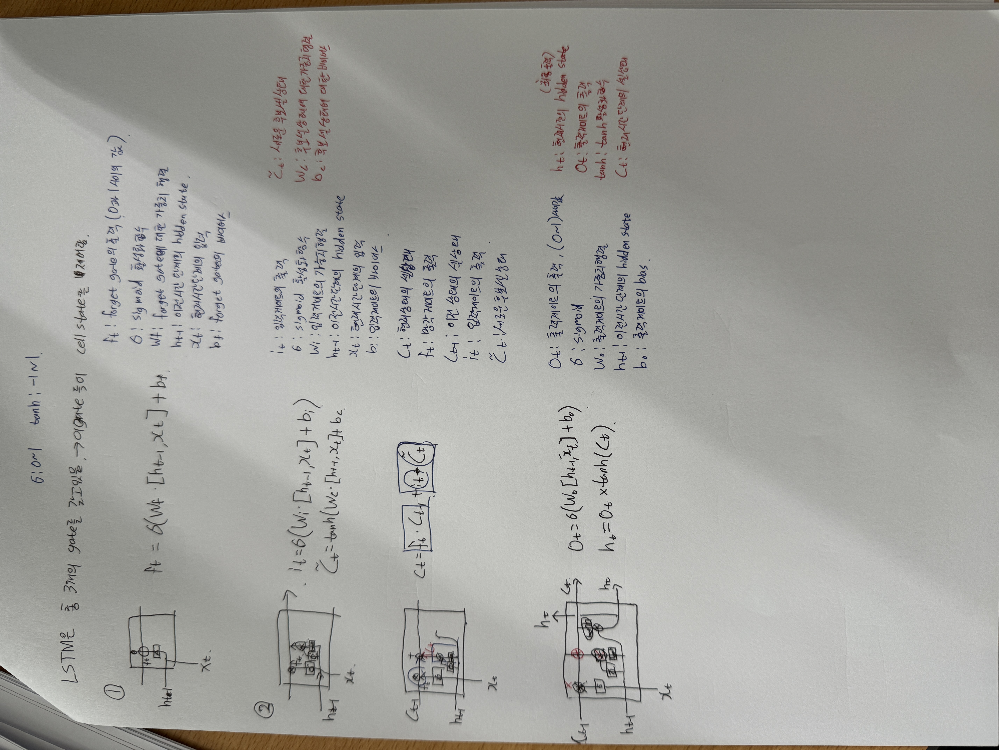

# LSTM (Long Short-Term Memory network)

### RNN
input: $X_{b}$, Output: $H_{t}$, $A$주변 테두리: network가 이전단계의 정보를 받는것
{: width="50%"}

RNN은 짧은 기간은 잘 찾을 수 있지만, 길어지면 문제가 됨.
LSTM은 긴 기간의 의존성을 갖고 있는 문제를 잘 해결할 수 있음.

#### - RNN 예시
{: width="30%"}

단순한 A(neural network) 1개 층만 이용함.

#### - LSTM 예시
{: width="45%"}

4개의 상호작용 레이어(3개의 Gate) 사용함.

1. 망각 게이트(Forget Gate) 레이어
    - $C_{t-1}$에서 어떤 정보를 잊을지 결정함.
2. 입력 게이트(Input Gate) 레이어
    - 현재 입력 $X_{t}$가 새로운 정보로 셀 상태에 얼마나 반영될지를 결정함.
3. 출력 게이트(Output Gate) 레이어
    - 현재 셀 상태 $C_{t}$에서 최종 hidden state $h_{t}$로 얼마나 반영될지를 결정함.
4. 셀 상태 업데이트(Candidate Cell State) 레이어
    - 새로운 후보 셀 상태 $\tilde{C}_{t}$를 생성해 셀 상태를 업데이트함.

## 종합적인 LSTM 작동 과정
네개의 상호작용 레이어를 함께 사용해 LSTM이 시퀀스 데이터에서 장기 의존성을 학습하고 중요한 정보를 선택적으로 기억하고 이잊는 과정을 효율적으로 수행할 수 있도록 함.

1. 망각 게이트 $f_{t}$가 이전 셀 상태 $C_{t-1}$에서 잊을 정보를 결정함.
2. 입력 게이트 $i_{t}$와 셀 상태 업데이트 레이어 $\tilde{C}_{t}$가 새로운 정보를 생성하고 이를 얼마나 반영 할지 결정함.
3. 이전 셀 상태 $C_{t-1}$는 망각 게이트 $f_{t}$에 의해 잊혀질 부분이 결정되고, 입력 게이트 $i_{t}$에 의해 새로운 정보 $\tilde{C}_{t}$가 반영되어 새로운 셀 상태 $C_{t}$가 됨.
    - $C_{t}$ = $f_{t}$$\cdot$$C_{t-1}$ + $i_{t}$ $\cdot$ $\tilde{C}_{t}$
4. 출력 게이트 $o_{t}$가 현재 셀 상태 $C_{t}$를 기반으로 최종 hidden state $h_{t}$를 결정함.
    - $h_{t}$ = $o_{t}$ $\cdot$ $\tanh$($C_{t}$)

### 종류별 비교
<table border="1">
  <tr>
    <th></th>
    <th>LSTM</th>
    <th>GRU</th>
    <th>RNN</th>
  </tr>
  <tr>
    <td>목적</td>
    <td>- Long Short Term Memory - RNN의 장기 의존성 문제를 해결</td>
    <td>- Gated Recurrent Unit - LSTM의 간결한 구조</td>
    <td>- Recurrent Neural Network - 단기 의존성을 잘 찾을 수 있는 구조</td>
  </tr>
  <tr>
    <td>구조</td>
    <td>- 게이트 3개  (입력 게이트, 출력 게이트, 망각 게이트) - 후보 셀 상태 1개</td>
    <td>- 게이트 2개  (업데이트 게이트, 리셋 게이트)</td>
    <td>- 게이트 없음  (입력층, 은닉층, 출력층)</td>
  </tr>
  <tr>
    <td>특징</td>
    <td>- 충분한 수의 데이터가 있을 경우 모델링 파워가 더 우수 - 복잡한 시퀀스 데이터의 장기 의존성 처리에 유리</td>
    <td>- 파라미터 수가 적어서 학습시간이 더 짧게 걸림 - 적은 학습 데이터로도 학습이 가능 - 계산 효율성 높음 - 간단한 구조로 인해 구현 및 튜닝이 용이함</td>
    <td>- 구조가 단순하고 이해하기 쉬움 - 단기 의존성 문제 해결에 적합 - 계산량이 적어 빠른 학습 가능</td>
  </tr>
</table>

### 내용
{: width="45%"}
{: width="45%"}

##### 참고 자료
1. https://dgkim5360.tistory.com/entry/understanding-long-short-term-memory-lstm-kr
2. https://huidea.tistory.com/237
3. https://karpathy.github.io/2015/05/21/rnn-effectiveness/
